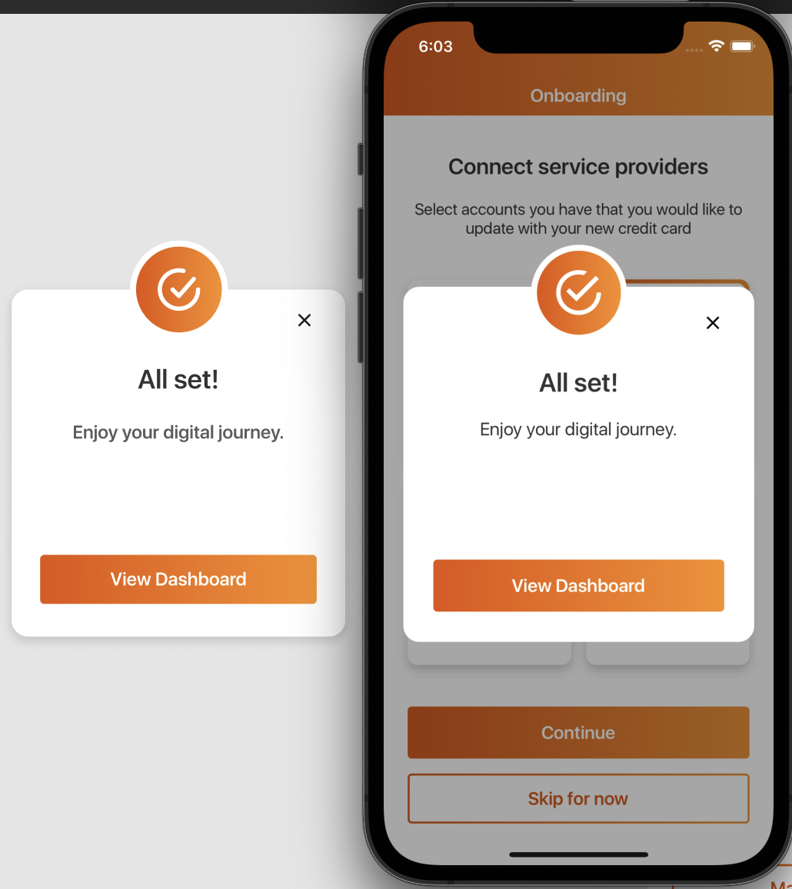
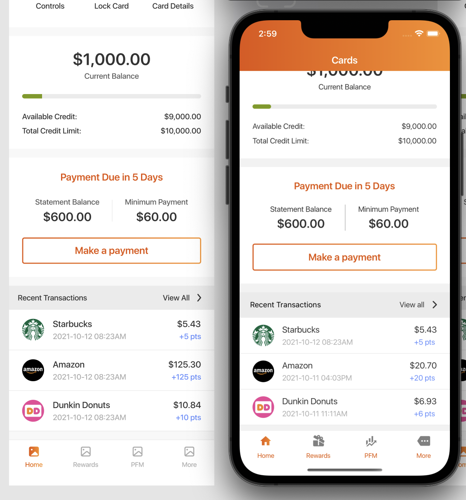
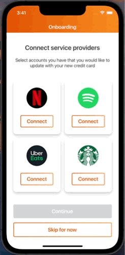
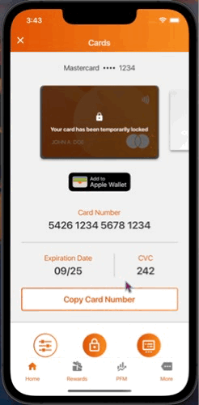

# Project Overview Result


## Implement the following screens: [Figma](https://www.figma.com/file/GQccaSiW6oFKzdCh6mmdGx/Sample-screens-for-dev-interview?type=design&node-id=1%3A4&mode=dev) / IOS is the target for this exercise.







## Think about component reusability.

This project was made following the atomic design methodolog so that way, almost every piece of this could be reusable.


Every component has it's own presentation and style file so they could be treated as individual entities.


The use of a theme file was implemented so that all the configuration of the application it's handled in one place.


So that way it can be easy to drastically change our project with few modifications.


Every component has it's default required "variantStyles" for theme purposes to work but they could also be modified with "customStyles" to expand their properties.


A pretty straightforward example it's this developed Transaction Page that uses the same component as the dashboard Page in that way this could be used on both screens easy!


## UI interactions matter.

UI displacement when keyboard it's active



Card selector for services selection


Animations when card controls are action and control per card


## Extras:

BottomTab navigation.


Card control page.


## Aditional Features!

Card slider for services selection


Cards selector with UI and state updates on displayed info



Transactions page


## Used Libraries

**_"@react-native-community/masked-view":_**
To handle background gradients on icons and texts.

**_"@react-navigation":_**
For all the screen navigation.

**_"react-native-linear-gradient":_**
To handle all the gradients.

**_"react-native-reanimated":_**
For UI animations.

**_"react-native-reanimated-carousel":_**
To display a nice and smooth carousel for cards selection

**_"react-native-vector-icons"_**: For all the icons used on the application

# Original requirements

- Implement the following screens: [Figma](https://www.figma.com/file/GQccaSiW6oFKzdCh6mmdGx/Sample-screens-for-dev-interview?type=design&node-id=1%3A4&mode=dev)
- IOS is the target for this exercise.
- Think about component reusability.

- UI interactions matter.

Extras:

- BottomTab navigation.
- Card control page.

Notes:

- Fork this project and share the link of the repository once you finish the excersie.

## Step 1: Install dependencies

First, you will need to install the project dependencies.

```bash
# using npm
npm install —legacy-peer-deps
```

## Step 2: Install IOS Dependencies

- Delete Podfile.loc

- Run the following

```bash
# using npm
cd ios
pod install
```

## Step 3: Start the Metro Server

First, you will need to start **Metro**, the JavaScript _bundler_ that ships _with_ React Native.

To start Metro, run the following command from the _root_ of your React Native project:

```bash
# using npm
npm start
```

## Step 4: Start your Application

Let Metro Bundler run in its _own_ terminal. Open a _new_ terminal from the _root_ of your React Native project. Run the following command to start your _iOS_ app:

### For iOS

```bash
# using npm
npm run ios
```

If everything is set up _correctly_, you should see your new app running in your _iOS Simulator_ shortly provided you have set up your emulator/simulator correctly.
